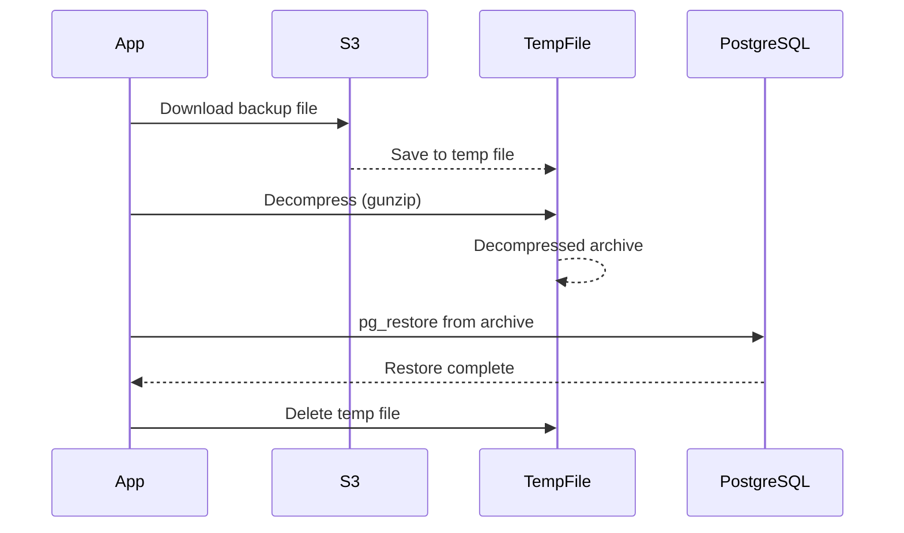

# PostgreSQL S3 Backup and Restore System - Restore Functionality Design

## Overview

This document outlines the design for adding restore functionality to the existing PostgreSQL S3 backup system. The restore feature will complement the backup system by allowing users to download backups from S3 and restore them to a PostgreSQL database using `pg_restore`. The design ensures reuse of existing codebase, S3 access logic, and deployment templates.

## 1. MODE Flag Integration

To switch between backup and restore operations, introduce a new environment variable `MODE` with possible values: `backup` (default) or `restore`.

- **Environment Variable**: `MODE` (string, default: "backup")
- **Integration**:
  - In `src/index.ts`, check the `MODE` value after loading environment variables.
  - If `MODE === "backup"`, proceed with existing backup logic.
  - If `MODE === "restore"`, import and call a new `restore()` function from `src/restore.ts`.
  - Add validation in `src/env.ts` to ensure `MODE` is either "backup" or "restore".
- **Benefits**: Allows the same container/deployment to handle both operations based on configuration, reducing duplication.

## 2. Environment Variables for Restore

Extend `src/env.ts` with restore-specific variables:

- `RESTORE_DATABASE_URL`: The connection string for the target PostgreSQL database to restore into (required for restore mode).
- `RESTORE_FILE_KEY`: Optional S3 key (filename) of the specific backup to restore. If not provided, the system could default to the latest backup (requires listing S3 objects).
- `RESTORE_CRON_SCHEDULE`: Cron schedule for scheduled restores (default: same as backup or disabled).
- `RESTORE_RUN_ON_STARTUP`: Boolean to run restore on startup (default: false).
- `RESTORE_SINGLE_SHOT_MODE`: Boolean to run a single restore and exit (default: false).
- `RESTORE_OPTIONS`: Any valid `pg_restore` options (default: "").

These variables will be conditionally required based on `MODE`.

## 3. High-Level Architecture for Restore Process

The restore process mirrors the backup process in reverse:

1. **Initialization**: Based on `MODE`, load appropriate environment variables and schedule or execute restore.
2. **Download from S3**:
   - Use AWS SDK S3 client to download the specified backup file (or latest if not specified).
   - Handle decompression if the file is gzipped (as backups are `.tar.gz`).
3. **Restore to PostgreSQL**:
   - Use `pg_restore` command to restore the database from the downloaded file.
   - Execute `pg_restore --dbname=${RESTORE_DATABASE_URL} ${RESTORE_OPTIONS} < decompressed_file`.
4. **Cleanup**: Delete the temporary downloaded file.
5. **Logging and Error Handling**: Log progress and handle errors gracefully.

### Sequence Diagram

## 4. Reuse of Existing S3 Access Code

- Extract S3 client creation into a utility function in `src/util.ts`:
  - `createS3Client()`: Returns configured S3Client instance, reusing logic from `uploadToS3`.
- For restore, add a new function `downloadFromS3` in `src/restore.ts`:
  - Use `GetObjectCommand` from `@aws-sdk/client-s3`.
  - Handle bucket subfolder and custom endpoints similarly to upload.
- Reuse MD5 validation if needed, but not required for restore.

## 5. Handling of Scheduling or Execution Modes for Restore

- **Single-Shot Mode**: Similar to backup, set `RESTORE_SINGLE_SHOT_MODE=true` to run once and exit.
- **Scheduled Mode**: Use `RESTORE_CRON_SCHEDULE` for periodic restores (e.g., for testing or automated recovery).
- **On-Startup Mode**: `RESTORE_RUN_ON_STARTUP=true` to restore immediately on container start.
- **Integration**: In `src/index.ts`, after checking `MODE`, apply similar logic as backup but for restore function.

## 6. Error Handling and Logging Considerations

- **Error Handling**:
  - Wrap restore operations in try-catch blocks, similar to `tryBackup`.
  - Validate downloaded file integrity (e.g., check if decompressed archive is valid).
  - Handle S3 errors (e.g., file not found), PostgreSQL connection errors, and `pg_restore` failures.
  - Exit with non-zero code on critical errors.
- **Logging**:
  - Use console.log for progress updates (e.g., "Downloading from S3...", "Restoring to DB...").
  - Log stderr from `pg_restore` for warnings/errors.
  - Include file sizes and timestamps in logs.
- **Additional Considerations**:
  - Add retries for transient S3 errors.
  - Ensure proper cleanup of temp files even on errors.

## Implementation Plan

1. Update `src/env.ts` to include MODE and restore variables.
2. Modify `src/index.ts` to handle MODE switching.
3. Create `src/restore.ts` with restore logic, reusing S3 utilities.
4. Update `src/util.ts` to extract S3 client creation.
5. Test integration with existing backup functionality.
6. Update README.md and Dockerfile if needed for restore mode.

This design maintains the simplicity and reliability of the existing system while adding robust restore capabilities.